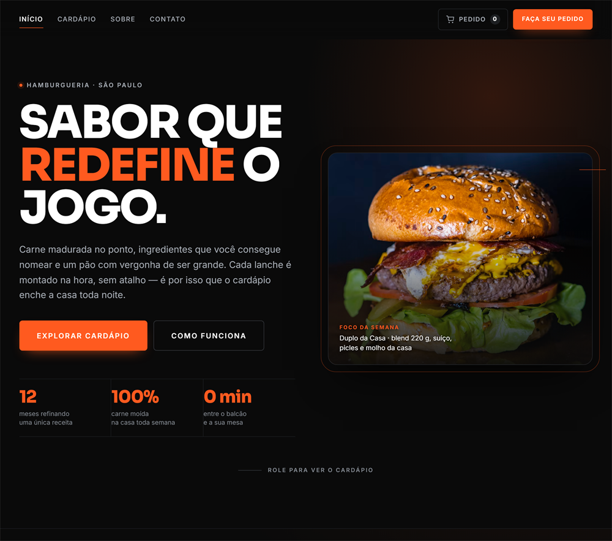
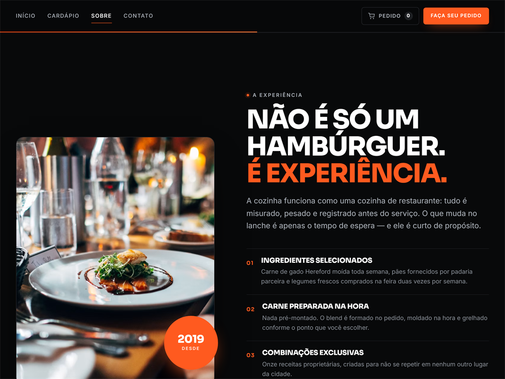
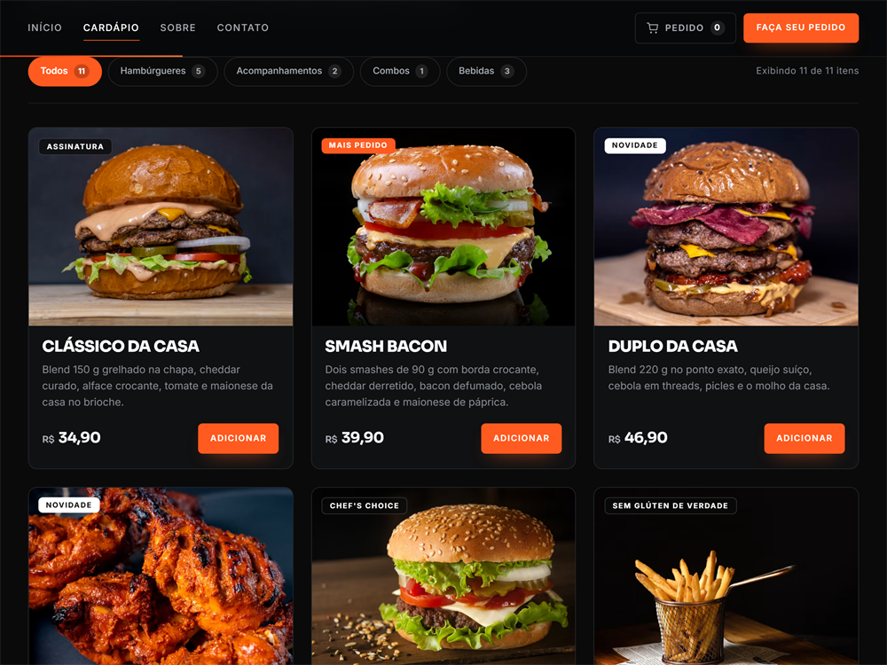
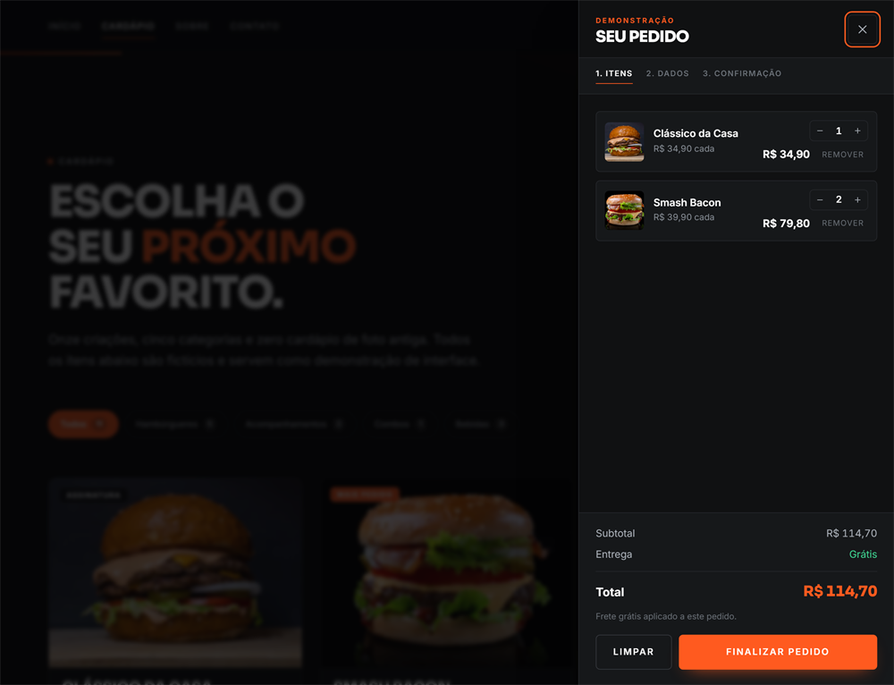
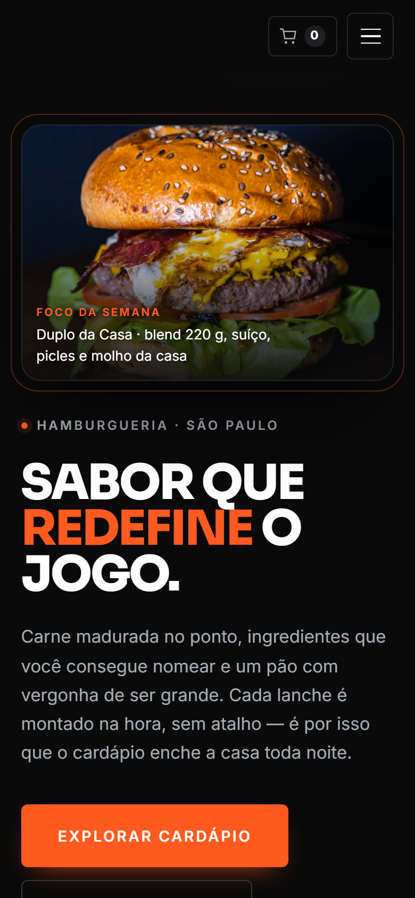
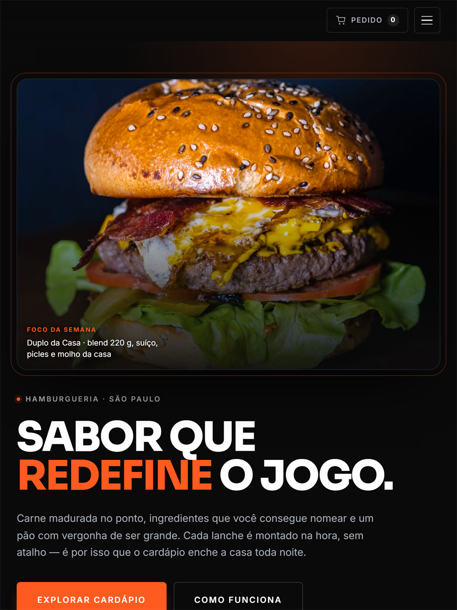
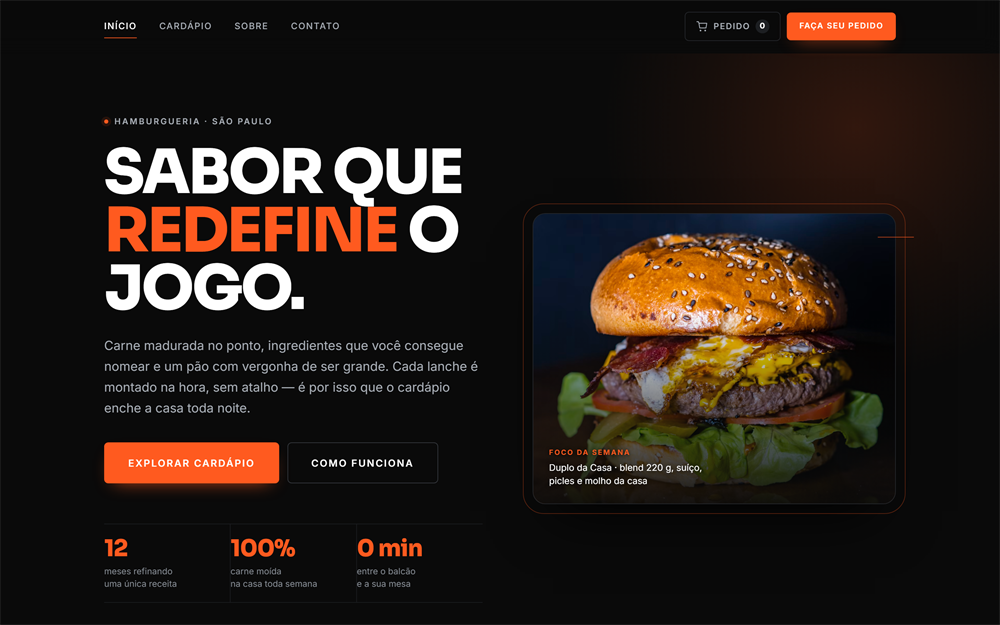
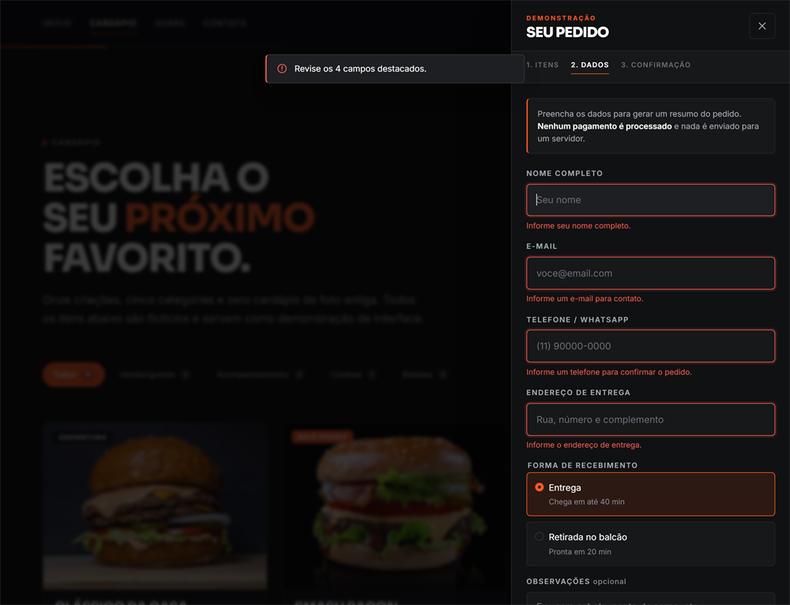

# Landing Page para Restaurante

Projeto conceitual de uma landing page para um restaurante.

A ideia foi criar uma interface moderna, responsiva e com foco na experiência do usuário, indo além de uma página apenas visual. O projeto conta com cardápio interativo, filtros, carrinho de compras, validações e diferentes estados de interação.



## Sobre o projeto

Neste projeto trabalhei principalmente a parte visual e a interação da página.

A interface foi pensada para apresentar os produtos de forma clara, valorizar as imagens dos alimentos e deixar a navegação simples tanto no computador quanto no celular.

Também quis explorar o JavaScript criando um carrinho de compras funcional, controle de quantidade, cálculo dos valores, opções de entrega e retirada e validação dos dados antes da confirmação do pedido.



## Funcionalidades

* Hero section
* Navbar fixa
* Navegação suave
* Cardápio interativo
* Filtros por categoria
* Adição de produtos ao carrinho
* Controle de quantidade
* Remoção de produtos
* Cálculo automático do subtotal
* Cálculo de frete
* Opção de retirada sem taxa
* Carrinho em formato de drawer
* Fluxo de pedido em etapas
* Formulário para dados do cliente
* Validação dos campos
* Indicação visual de erros
* Feedback visual das ações
* Estado de carrinho vazio
* Layout responsivo
* Animações e transições
* Suporte a `prefers-reduced-motion`
* Navegação por teclado
* Recursos de acessibilidade

### Cardápio interativo

Filtros por categoria, etiqueta de destaque, preço e botão de adicionar direto no card.



### Carrinho funcional

Drawer lateral com controle de quantidade, subtotal, frete e total calculados em tempo real.



## Tecnologias

* HTML5
* CSS3
* JavaScript
* Git
* GitHub

O projeto foi desenvolvido utilizando JavaScript puro, sem frameworks.

## Design e responsividade

A interface utiliza uma estética escura, com detalhes em laranja e bastante contraste para destacar os produtos e as principais ações.

A página foi adaptada para diferentes tamanhos de tela, mantendo uma experiência consistente em desktop, tablet e dispositivos móveis.

Também foram considerados aspectos como espaçamento, hierarquia de informações, contraste, estados de interação, foco dos elementos e acessibilidade.

| Smartphone | Tablet | Desktop |
| --- | --- | --- |
|  |  |  |

## Testes

Depois do desenvolvimento, foi realizada uma etapa de testes para verificar o funcionamento das principais partes da aplicação.

Foram testados:

* Adição de produtos
* Agrupamento de itens iguais
* Alteração de quantidade
* Remoção de produtos
* Carrinho vazio
* Cálculo dos valores
* Frete grátis acima do valor definido
* Retirada sem taxa
* Validação do formulário
* `aria-invalid`
* Foco automático no primeiro erro
* Navegação por teclado
* Focus trap no carrinho
* Fechamento com `ESC`
* Restauração do foco
* Responsividade em diferentes resoluções
* Ausência de rolagem horizontal
* Carregamento das imagens
* Links internos
* IDs duplicados
* Preferência por movimento reduzido

A versão final foi revisada após os testes e os problemas encontrados durante esse processo foram corrigidos.

Indicação visual dos campos com erro no formulário de dados do pedido:



## Estrutura

```text
├── docs/
│   ├── 01-hero.png
│   ├── 02-cardapio.png
│   ├── 03-carrinho.png
│   ├── 04-validacao.png
│   ├── 05-experiencia.png
│   ├── 06-mobile.png
│   ├── 07-tablet.png
│   └── 08-desktop.png
├── index.html
├── style.css
├── script.js
└── README.md
```

## Como executar

Clone o repositório:

```bash
git clone SEU_LINK_DO_GITHUB
```

Entre na pasta:

```bash
cd NOME_DO_PROJETO
```

Depois, basta abrir o arquivo `index.html` no navegador.

Também é possível executar um servidor local com Python:

```bash
python -m http.server 8000
```

Depois acesse:

```text
http://localhost:8000
```

## O que pratiquei neste projeto

Este projeto reuniu diferentes partes do desenvolvimento Front-end em uma única aplicação.

Principalmente:

* Estruturação de páginas com HTML semântico
* Organização de CSS
* Responsividade
* Manipulação do DOM
* Eventos em JavaScript
* Controle de estado do carrinho
* Validação de formulários
* Acessibilidade
* Animações e transições
* Experiência do usuário
* Organização e revisão de código

Uma das partes mais trabalhadas foi o carrinho, justamente para transformar a página em algo mais próximo de uma aplicação real e não somente uma interface estática.

## Próximos passos

Algumas funcionalidades poderiam ser adicionadas em uma versão futura:

* Integração com backend
* Persistência do carrinho no servidor
* Banco de dados
* Sistema real de pedidos
* Painel administrativo
* Integração com API
* Sistema de pagamento
* Autenticação de usuários

Essas funcionalidades não fazem parte da versão atual do projeto.

## Observação

Este é um projeto conceitual.

Os produtos, preços, informações comerciais, endereço, avaliações e demais dados apresentados na interface são fictícios.
